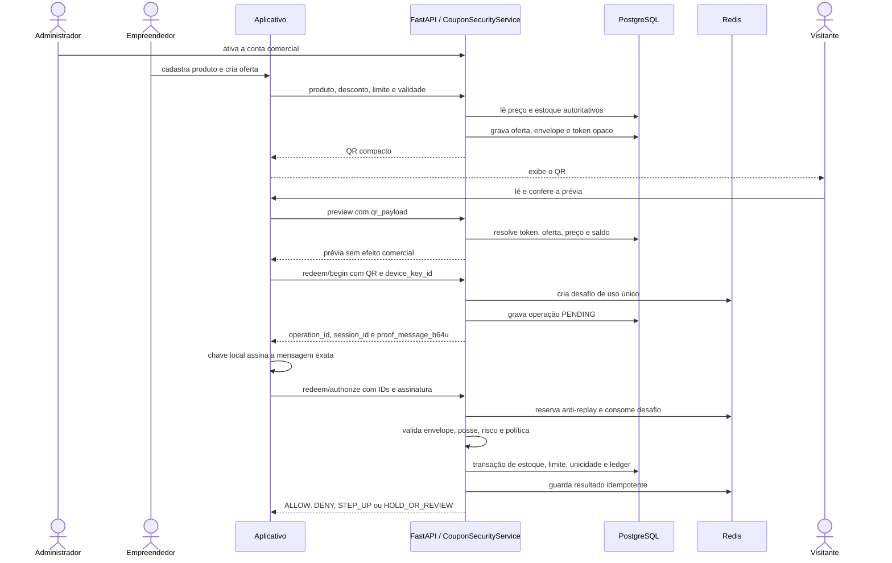

# Como o TRQ-BEC funciona no LiberRotas

Este documento explica o fluxo implementado no projeto, do cadastro do produto
até a confirmação do resgate. Ele descreve o comportamento atual do código e
não deve ser interpretado como certificação criptográfica ou financeira.

## Resumo em linguagem simples

O TRQ-BEC é a fronteira de autorização dos cupons do LiberRotas. O aplicativo
coleta a intenção do usuário, lê ou mostra o QR e assina um desafio com a chave
local do dispositivo. O backend decide se a operação pode acontecer.

Três regras ajudam a entender todo o desenho:

1. o aplicativo não decide preço, estoque, desconto nem sucesso do resgate;
2. o QR não carrega esses valores como fonte de verdade: ele leva uma referência
   opaca, emissor, validade, quantidade e, quando necessário, a prova da quantidade;
3. somente o commit no PostgreSQL confirma o efeito comercial.

## Componentes e responsabilidades

| Componente | Responsabilidade |
|---|---|
| Aplicativo Expo | autenticar com Firebase, cadastrar a chave do aparelho, ler/mostrar QR, assinar `proof_message_b64u` e exibir a decisão |
| Firebase Authentication | comprovar a identidade da sessão e fornecer o ID token |
| FastAPI | validar o contrato, autenticar a sessão e encaminhar a operação ao serviço autoritativo |
| `CouponSecurityService` | aplicar permissões e orquestrar emissão, prévia, desafio e autorização |
| PostgreSQL | guardar comerciante, produto, preço, estoque, oferta, operação, resgate e ledger |
| Redis | manter desafio curto, reserva anti-replay, resultado idempotente e contador de taxa |
| Chave do dispositivo | produzir a prova de posse; a chave privada permanece no armazenamento local do aparelho/navegador |
| Policy/Risk Engine | produzir uma decisão determinística a partir dos controles criptográficos e sinais disponíveis |
| Ledger | registrar evidência sanitizada e encadeada da decisão |

## Pré-condições

Antes de emitir ou resgatar um cupom:

- a sessão Firebase precisa ser válida;
- o backend precisa reconhecer função, status e permissões da conta;
- o empreendedor precisa ter conta comercial ativa e produto ativo com estoque;
- o dispositivo precisa estar cadastrado e ativo;
- PostgreSQL e Redis precisam estar disponíveis.

O frontend nunca envia função confiável, dono do produto ou autorização final.
Esses dados são derivados novamente no backend.

## Fluxo completo



## Etapa 1 — produto e oferta

1. O empreendedor cadastra o produto em `POST /v1/marketplace/products`.
2. O backend associa o produto ao UID autenticado e guarda preço, moeda e estoque.
3. Para emitir a oferta, o aplicativo chama `POST /v1/trq-bec/coupons/issue`.
4. O backend relê produto, preço e estoque; calcula o desconto e verifica validade
   e limite de resgates.
5. O backend cria um `Intent`, emite o envelope criptográfico, gera `token_ref`
   aleatório e grava oferta, token e evidência.
6. A resposta contém um QR compacto. O envelope completo continua no backend.

Alterar os valores visuais no aplicativo não altera o valor autoritativo.

## Etapa 2 — o que existe no QR

Um QR individual usa o tipo `trq-bec-offer-v1` e contém:

- `token_ref`: referência aleatória usada para localizar o registro no backend;
- `issuer_ref`: referência sanitizada do emissor;
- `expires_at`: prazo vinculado à oferta;
- `quantity`: quantidade solicitada;
- `quantity_proof_b64u`: obrigatória quando a quantidade é maior que um.

Preço, desconto, estoque, nome do comprador, chave privada e envelope completo não
são aceitos do QR como fonte de verdade.

O QR combinado `trq-bec-offer-bundle-v1` reúne de dois a cinco QRs individuais
do mesmo vendedor. Ele melhora a leitura, mas não cria uma transação única: cada
item tem operação, decisão e possível falha independentes.

## Etapa 3 — prévia

`POST /v1/trq-bec/coupons/preview` valida formato, vínculo, validade, situação da
oferta, estoque e quantidade. A API então devolve os valores atuais calculados no
servidor. A prévia não reduz estoque, não consome cupom e não prova uma venda.

## Etapa 4 — início do resgate

`POST /v1/trq-bec/coupons/redeem/begin`:

1. exige visitante autorizado e permissão `coupons.redeem`;
2. rejeita autorresgate;
3. valida QR, oferta, dispositivo e quantidade;
4. cria `operation_id`, `session_id` e `replay_jti` independentes;
5. solicita ao Redis um desafio curto e de uso único;
6. grava a operação como `PENDING` no PostgreSQL;
7. devolve `proof_message_b64u`, a única mensagem que o dispositivo deve assinar.

A mensagem vincula envelope, desafio, sessão, operação anti-replay e chave do
dispositivo. O aplicativo não monta uma mensagem alternativa.

## Etapa 5 — autorização

Depois de assinar a mensagem localmente, o aplicativo chama
`POST /v1/trq-bec/coupons/redeem/authorize`. Didaticamente, a autorização passa
por cinco portas:

| Porta | O que precisa ser verdadeiro |
|---|---|
| 1. Contrato e autoridade | sessão, função, permissão e IDs pertencem à mesma operação |
| 2. Integridade criptográfica | envelope, intenção, emissor, audiência, suíte, política e validade são coerentes |
| 3. Posse, frescor e anti-replay | assinatura do dispositivo é válida, desafio existe e ainda não foi consumido, replay não pertence a outra operação |
| 4. Risco e política | sinais têm cobertura suficiente e a política versionada produz a decisão |
| 5. Commit e evidência | PostgreSQL confirma estoque, limite, um uso por comprador e ledger na transação autoritativa |

Se a integridade criptográfica falhar, a decisão não pode ser `ALLOW`. Se Redis
ou PostgreSQL estiverem indisponíveis em um ponto crítico, o fluxo falha fechado;
não existe resgate comercial final offline.

## Concorrência, repetição e idempotência

- O desafio só pode ser consumido uma vez.
- O Redis reserva `replay_jti` antes da autorização.
- Repetir exatamente a mesma operação pode recuperar o resultado já confirmado
  e retorna `idempotent=true`.
- Reutilizar a prova em outra operação, sessão ou chave falha por vínculo.
- O PostgreSQL bloqueia produto/oferta durante o commit e impede estoque negativo,
  estouro de limite e segundo resgate da mesma oferta pelo mesmo comprador.
- O aplicativo repete `authorize` somente em falhas recuperáveis e com os mesmos
  IDs e a mesma assinatura; ele não inicia uma segunda operação silenciosamente.

## Decisões

| Decisão | Significado para o aplicativo |
|---|---|
| `ALLOW` | resgate confirmado no backend |
| `DENY` | resgate negado; `reason_codes` explica a causa técnica |
| `STEP_UP` | política solicita verificação adicional; não equivale a venda confirmada |
| `HOLD_OR_REVIEW` | operação retida para revisão; não equivale a venda confirmada |

Somente `ALLOW` acompanhado do resultado autoritativo deve ser mostrado como
resgate concluído.

## Estado criptográfico atual e limite de produção

A versão atual usa `ED25519_LAB` para assinatura do envelope e prova de posse no
perfil acadêmico. Isso permite estudar e testar o protocolo, mas não equivale a
provider pós-quântico homologado ou chave com atestação de hardware.

Verifique o ambiente em execução na pasta `backend_trq_bec`:

```powershell
Invoke-RestMethod http://127.0.0.1:8787/health/crypto | ConvertTo-Json
```

Enquanto a resposta indicar `ready=false`, provider `UNAVAILABLE` ou o estado
`LAB_ED25519_PQ_BLOCKED`, o projeto não deve ser descrito como pronto para
produção criptográfica pós-quântica.

## Onde estudar no código

- cliente de marketplace: `mobile_app/src/features/marketplace/api.ts`;
- cliente do fluxo TRQ-BEC: `mobile_app/src/features/trq-bec/api.ts`;
- contratos TypeScript: `mobile_app/src/security/trq-bec/contracts.ts`;
- routers públicos: `server/routers/marketplace.py` e `server/routers/coupons.py`;
- orquestração autoritativa: `server/service.py`;
- envelope, desafio e replay: `protocol/`;
- decisão: `risk/` e `policy/`;
- evidência: `ledger/`.

## O que o TRQ-BEC não faz nesta fase

- não processa Pix, cartão, pagamento, liquidação ou estorno;
- não prova faturamento contábil;
- não autoriza resgate offline;
- não transforma recomendação de IA em decisão automática;
- não implementa ainda o provider PQC aprovado exigido para produção;
- não substitui homologação em aparelho físico, teste de carga ou auditoria externa.
